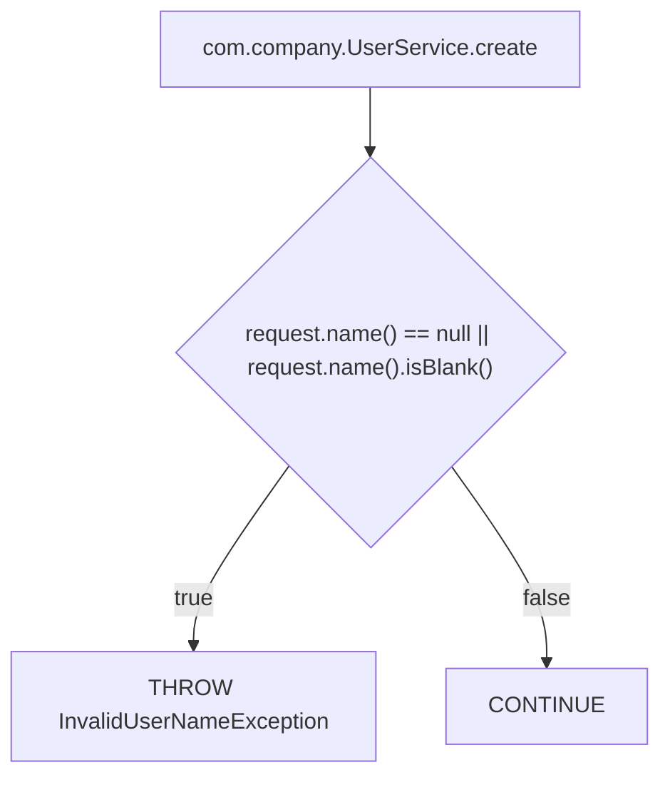

# Phase 4 - Decision Trace Contract

## Objective

Phase 4 adds a deterministic semantic layer for decisions found in Java/Spring
code. A decision is a source-level rule that affects control flow or outcome:
conditions, validations, conditional throws, early returns, guarded calls,
switch cases, ternaries, supported `Optional` branches, and supported stream
filters.

Decision Trace answers questions such as:

- How is the user name validated?
- How is the e-mail validated?
- When is registration rejected?
- Which conditions return an error?
- Which rules stop the flow from continuing?
- Which decisions exist inside a method or flow?
- Where is a decision implemented?
- What changed in a rule after a refactor?

The output must stay deterministic and source-grounded. Phase 4 does not add an
AI interpretation layer.

## Layer Separation

Code Atlas keeps four layers separate:

1. Project Index: structural inventory of the project.
2. Flow Graph: technical call graph, resolution, boundaries, and unresolved
   flow items.
3. Decision Trace: decisions, conditions, validations, conditional throws,
   early returns, and explicit outcomes.
4. AI Interpretation: natural language interpretation and synthesis built on
   deterministic artifacts.

Decision Trace is separate from Flow Graph because a rule can be useful even
when call resolution is incomplete. For example, an `if` condition inside the
method currently being analyzed should be captured even if the analyzer cannot
resolve which implementation of an interface is called later.

Decision Trace is separate from Project Index because the index is an inventory
of types, methods, beans, repositories, clients, and entrypoints. Decision Trace
captures source-level behavior inside those methods. It can reference the index
for context, but it must not duplicate the index.

AI interpretation remains outside Phase 4. Phase 4 may emit deterministic
labels when they are based on explicit rules, but it must not infer business
meaning from ambiguous code. When the analyzer cannot classify a decision
deterministically, it must use `UNKNOWN` and preserve source evidence.

## Generated Artifacts

Decision Trace writes artifacts under the analyzed project:

```text
<project>/.code-atlas/decisions/<entrypoint-or-scope>/decisions.json
<project>/.code-atlas/decisions/<entrypoint-or-scope>/decisions.md
<project>/.code-atlas/decisions/<entrypoint-or-scope>/decisions.mmd
```

Future project-wide indexes may be added:

```text
<project>/.code-atlas/decisions-index.json
<project>/.code-atlas/decisions-index.md
```

The MVP focuses on one entrypoint, method, endpoint, listener, or job at a time.
Project-wide decision indexing is explicitly later work.

Decision artifacts must remain separate from `flow.json`,
`project-index.json`, and `entrypoints.json`. They may reference those files,
but must not copy their node lists, edge lists, boundaries, type inventories, or
entrypoint inventories.

## Planned Commands

Analyze decisions for a Java entrypoint:

```bash
./gradlew run --args="analyze-decisions --project ./repo --entrypoint com.company.FooService.method"
```

Analyze decisions for a Spring endpoint:

```bash
./gradlew run --args="analyze-decisions --project ./repo --endpoint 'POST /auth/register'"
```

Future project-wide indexing:

```bash
./gradlew run --args="index-decisions --project ./repo"
```

`index-decisions` is not part of the initial MVP. The first production
implementation should focus on `analyze-decisions` by method or endpoint.

## `decisions.json` Schema

`decisions.json` is the primary Phase 4 artifact. Markdown and Mermaid outputs
are derived views.

`decisions.json` is also a canonical text artifact. The output writer must use
deterministic pretty printing with two-space indentation, record/model field
order, sorted map entries when maps are present, empty arrays as `[]`, and one
final newline. Fixture tests may compare generated JSON against
`expected/decisions.json` as raw text. This formatting policy does not change
the semantic contract and belongs to `com.codeatlas.output.decision.json`, not
to `com.codeatlas.core.decision`.

Top-level fields:

| Field | Type | Required | Description |
| --- | --- | --- | --- |
| `schemaVersion` | string | yes | Decision Trace schema version. Current value: `1.0`. |
| `generatedAt` | string | yes | ISO-8601 timestamp. Deterministic tests may use `1970-01-01T00:00:00Z`. |
| `project` | string | yes | Normalized project root. Fixtures may use a relative fixture path for portability. |
| `scope` | object | yes | Scope analyzed by the command. |
| `source` | object | yes | Optional references to related Code Atlas artifacts. |
| `decisions` | array | yes | Deterministic decision descriptors. Can be empty. |
| `unresolved` | array | yes | Decision-specific unresolved items. Can be empty. |
| `metadata` | object | yes | Analyzer metadata and compatibility flags. |

`scope` fields:

| Field | Type | Required | Description |
| --- | --- | --- | --- |
| `kind` | string | yes | `ENTRYPOINT`, `ENDPOINT`, `METHOD`, `FILE`, `LISTENER`, `JOB`, or `UNKNOWN`. |
| `entrypoint` | string or null | yes | Java entrypoint when known. |
| `endpoint` | string or null | yes | HTTP endpoint when the command was endpoint-based. |

`source` fields:

| Field | Type | Required | Description |
| --- | --- | --- | --- |
| `flowRef` | string or null | yes | Relative or absolute reference to `flow.json`, when available. |
| `projectIndexRef` | string or null | yes | Relative or absolute reference to `project-index.json`, when available. |

Decision descriptor fields:

| Field | Type | Required | Description |
| --- | --- | --- | --- |
| `id` | string | yes | Stable id prefixed with `decision:`. |
| `kind` | string | yes | Taxonomy value such as `IF_CONDITION` or `CONDITIONAL_THROW`. |
| `category` | string | yes | Deterministic category, or `UNKNOWN`. |
| `method` | string | yes | Method where the decision was found. |
| `sourceLocation` | object | yes | Project-relative source file and 1-based line. |
| `expression` | object | yes | Source expression and optional deterministic normalized form. |
| `subjects` | array | yes | Source subjects affected by the condition. |
| `outcomes` | array | yes | Explicit branch outcomes. |
| `evidence` | object | yes | Source evidence for the decision. |
| `links` | object | yes | Lightweight references to other artifacts. |
| `confidence` | string | yes | `HIGH`, `MEDIUM`, `LOW`, or `UNKNOWN`. |

`sourceLocation` fields:

| Field | Type | Required | Description |
| --- | --- | --- | --- |
| `file` | string | yes | Project-relative source file. |
| `line` | number | yes | 1-based line number for the decision expression or statement. |

`expression` fields:

| Field | Type | Required | Description |
| --- | --- | --- | --- |
| `text` | string | yes | Exact or near-exact source expression text. |
| `normalized` | string or null | yes | Deterministic normalized expression when supported. |

`subjects` fields:

| Field | Type | Required | Description |
| --- | --- | --- | --- |
| `name` | string | yes | Source-level subject such as `request.name`. |
| `kind` | string | yes | `INPUT_FIELD`, `PARAMETER`, `LOCAL_VARIABLE`, `REPOSITORY_QUERY`, `METHOD_RESULT`, `STATE`, or `UNKNOWN`. |

`outcomes` fields:

| Field | Type | Required | Description |
| --- | --- | --- | --- |
| `when` | string | yes | Branch condition such as `true`, `false`, `case ACTIVE`, or `default`. |
| `action` | string | yes | Outcome action taxonomy. |
| `target` | string or null | yes | Exception, returned value, called method, assigned variable, or null. |
| `meaning` | string | yes | Deterministic human-readable meaning, or a source-grounded description. |

`evidence` fields:

| Field | Type | Required | Description |
| --- | --- | --- | --- |
| `kind` | string | yes | Current MVP value: `SOURCE_TEXT`. |
| `snippet` | string | yes | Short source excerpt. Do not store large method bodies. |

`links` fields:

| Field | Type | Required | Description |
| --- | --- | --- | --- |
| `flowNodeIds` | array | yes | Flow node ids related to the decision, when available. |
| `calledMethods` | array | yes | Method names directly related to the outcome, when available. |
| `relatedBoundaries` | array | yes | Boundary ids or names related to the decision, when available. |

Example:

```json
{
  "schemaVersion": "1.0",
  "generatedAt": "1970-01-01T00:00:00Z",
  "project": "/path/to/project",
  "scope": {
    "kind": "ENTRYPOINT",
    "entrypoint": "com.company.FooService.method",
    "endpoint": null
  },
  "source": {
    "flowRef": ".code-atlas/flows/com/company/FooService/method/flow.json",
    "projectIndexRef": ".code-atlas/project-index.json"
  },
  "decisions": [
    {
      "id": "decision:com.company.UserService.create:name-required",
      "kind": "IF_CONDITION",
      "category": "VALIDATION",
      "method": "com.company.UserService.create",
      "sourceLocation": {
        "file": "src/main/java/com/company/UserService.java",
        "line": 42
      },
      "expression": {
        "text": "request.name() == null || request.name().isBlank()",
        "normalized": "isNullOrBlank(request.name)"
      },
      "subjects": [
        {
          "name": "request.name",
          "kind": "INPUT_FIELD"
        }
      ],
      "outcomes": [
        {
          "when": "true",
          "action": "THROW",
          "target": "InvalidUserNameException",
          "meaning": "Name is rejected"
        },
        {
          "when": "false",
          "action": "CONTINUE",
          "target": null,
          "meaning": "Name is accepted by this check"
        }
      ],
      "evidence": {
        "kind": "SOURCE_TEXT",
        "snippet": "if (request.name() == null || request.name().isBlank()) { throw new InvalidUserNameException(...); }"
      },
      "links": {
        "flowNodeIds": [],
        "calledMethods": [],
        "relatedBoundaries": []
      },
      "confidence": "HIGH"
    }
  ],
  "unresolved": [],
  "metadata": {
    "analyzer": "source-text-decision-trace",
    "phase": "phase-4-decision-trace",
    "deterministic": true,
    "source": "source-text"
  }
}
```

## Decision Kind Taxonomy

Initial taxonomy:

- `IF_CONDITION`
- `IF_ELSE_CONDITION`
- `EARLY_RETURN`
- `CONDITIONAL_THROW`
- `SWITCH_CASE`
- `TERNARY_CONDITION`
- `OPTIONAL_BRANCH`
- `STREAM_FILTER`
- `UNKNOWN_CONDITION`

Initial production MVP should implement only:

- `IF_CONDITION`
- `CONDITIONAL_THROW`
- `EARLY_RETURN`

The remaining kinds are reserved for later Phase 4 increments. Unsupported
constructs should be represented as unresolved decisions instead of guessed.

## Category Taxonomy

Initial categories:

- `VALIDATION`
- `AUTHORIZATION`
- `BUSINESS_RULE`
- `ERROR_HANDLING`
- `ROUTING`
- `TRANSFORMATION`
- `SIDE_EFFECT_GUARD`
- `UNKNOWN`

Categories must be deterministic. Examples of acceptable deterministic signals:

- Throwing an exception named like `InvalidNameException` from a null or blank
  input check can be `VALIDATION`.
- Checking an authenticated principal, role, permission, or ownership guard can
  be `AUTHORIZATION`.
- Guarding an external write, notification, payment, or repository mutation can
  be `SIDE_EFFECT_GUARD`.

If the analyzer has no clear source-based rule, category must be `UNKNOWN`.
Phase 4 must not invent business meaning using AI.

## Outcome Actions

Initial action taxonomy:

- `THROW`
- `RETURN`
- `CONTINUE`
- `CALL`
- `ASSIGN`
- `MAP`
- `FILTER`
- `UNKNOWN`

Initial production MVP should support:

- `THROW`
- `RETURN`
- `CONTINUE`
- `CALL`
- `UNKNOWN`

Outcomes must be explicit and simple. A decision may have more than two outcomes
for switch cases or future multi-branch constructs.

## Decision Unresolved Items

Decision Trace has its own unresolved list. It is separate from Flow Graph
unresolved items because a decision can fail to normalize even when the call
graph succeeds, and the call graph can fail even when a local condition is clear.

Examples:

- Expression not parsed.
- Branch not classified.
- Complex condition not normalized.
- Lambda not supported.
- Optional chain not supported.
- Stream pipeline not supported.
- External validation method not expanded.

Format:

```json
{
  "id": "unresolved-decision:com.company.UserService.create:optional-chain",
  "kind": "UNSUPPORTED_EXPRESSION",
  "method": "com.company.UserService.create",
  "sourceLocation": {
    "file": "src/main/java/com/company/UserService.java",
    "line": 42
  },
  "message": "Optional chain decision is not supported in this phase",
  "expression": "optional.map(...).orElseThrow(...)"
}
```

Initial unresolved kind values:

- `UNSUPPORTED_EXPRESSION`
- `UNSUPPORTED_BRANCH`
- `UNSUPPORTED_LAMBDA`
- `UNSUPPORTED_OPTIONAL_CHAIN`
- `UNSUPPORTED_STREAM_PIPELINE`
- `EXTERNAL_VALIDATION_NOT_EXPANDED`
- `UNKNOWN_DECISION_SHAPE`

## Relationship With Flow Graph

Decision Trace may reference Flow Graph, but does not require it.

Rules:

- `decisions.json` may include `source.flowRef` when a flow was generated.
- A decision may include `links.flowNodeIds` when a matching flow node is known.
- Decision Trace must still work for a method or file when no flow exists.
- Do not copy flow `nodes` into `decisions.json`.
- Do not copy flow `edges` into `decisions.json`.
- Do not copy flow `boundaries` into `decisions.json`.
- Use lightweight links only.

This keeps decision analysis useful before complete interface resolution and
prevents `flow.json` from becoming a mixed semantic artifact.

## Relationship With Project Index

Decision Trace may use Project Index for context, but it must not require it as
an absolute prerequisite.

Rules:

- Project Index may help resolve a method, entrypoint, endpoint, or source file.
- `decisions.json` may include `source.projectIndexRef`.
- Do not copy classes, interfaces, implementations, beans, repositories,
  clients, or entrypoints into `decisions.json`.
- When a decision is found inside a concrete implementation and the real method
  is known, record that concrete method.
- When the real method is not known, record the method where the decision was
  found.

This keeps Project Index as the structural inventory and Decision Trace as the
behavioral rule artifact.

## `decisions.md` Format

`decisions.md` is a derived human-readable view of `decisions.json`.

Expected structure:

```markdown
# Decision Trace

Scope: `com.company.UserService.create`

Source:

- Flow: `.code-atlas/flows/com/company/UserService/create/flow.json`
- Project Index: `.code-atlas/project-index.json`

## Decisions

| ID | Kind | Category | Method | Location | Expression | Outcomes |
| --- | --- | --- | --- | --- | --- | --- |
| `decision:...` | IF_CONDITION | VALIDATION | `com.company.UserService.create` | `src/main/java/...:42` | `request.name() == null` | true -> THROW `InvalidNameException`; false -> CONTINUE |

## Unresolved

No unresolved decision items.
```

Markdown must not add facts that are absent from JSON. It may shorten long
expressions for readability if the JSON remains the source of truth.

## `decisions.mmd` Format

`decisions.mmd` is a derived Mermaid view for local visualization.

Expected structure:



Mermaid output should stay small. It should show decision shape and outcomes,
not the full call graph.

## Examples of Decisions

Validation:

```java
if (request.name() == null || request.name().isBlank()) {
    throw new InvalidUserNameException("Name is required");
}
```

Expected decision:

- `kind`: `IF_CONDITION`
- `category`: `VALIDATION`
- `outcomes`: `true -> THROW InvalidUserNameException`, `false -> CONTINUE`

Early return:

```java
if (request.processed()) {
    return ProcessingResult.alreadyProcessed(request.id());
}
```

Expected decision:

- `kind`: `EARLY_RETURN`
- `category`: `BUSINESS_RULE` or `UNKNOWN`, depending on deterministic signals
- `outcomes`: `true -> RETURN`, `false -> CONTINUE`

Conditional throw:

```java
if (userRepository.existsByEmail(request.email())) {
    throw new EmailAlreadyExistsException(request.email());
}
```

Expected decision:

- `kind`: `CONDITIONAL_THROW`
- `category`: `VALIDATION`
- `outcomes`: `true -> THROW EmailAlreadyExistsException`, `false -> CONTINUE`

Unsupported optional chain:

```java
return Optional.ofNullable(request.email())
        .filter(email -> email.contains("@"))
        .orElseThrow(InvalidEmailException::new);
```

Initial expected result:

- no guessed decision;
- unresolved item with kind `UNSUPPORTED_OPTIONAL_CHAIN` or
  `UNSUPPORTED_EXPRESSION`;
- source expression preserved as evidence.

## Out of Scope for Phase 4

- AI-generated business interpretation.
- LLM-based classification.
- Natural language question answering.
- Full data-flow analysis.
- Full symbolic execution.
- Runtime tracing.
- IntelliJ PSI coupling.
- Project-wide decision indexing as the first MVP.
- Duplicating `flow.json`, `project-index.json`, or `entrypoints.json`.
- Complete support for lambdas, method references, `Optional`, streams,
  ternaries, and switch expressions in the initial implementation.

## Internal Roadmap

Phase 4.0 - Contract and examples:

- Define Decision Trace artifacts.
- Define `decisions.json`, `decisions.md`, and `decisions.mmd` contracts.
- Add small fixtures with expected outputs.
- Validate expected JSON shape.
- Do not implement production decision parsing.

Phase 4.1 - Minimal source-text decision analyzer:

- Add `analyze-decisions`.
- Support Java method scope through `--entrypoint`.
- Extract `CONDITIONAL_THROW` for direct `if (...) { throw new ...; }`
  decisions.
- Emit separate decision artifacts under `.code-atlas/decisions/...`.
- Keep analyzer deterministic and independent from IntelliJ PSI.

Phase 4.1.1 - Decision package architecture refactor:

- Keep `com.codeatlas.core.decision` language-agnostic.
- Route `analyze-decisions` through `com.codeatlas.application.decision`.
- Keep Java source-text extraction in
  `com.codeatlas.adapter.java.source.decision`.
- Keep Decision Trace writers under `com.codeatlas.output.decision`.
- Add future Kotlin and JS/TS support through new language adapters instead of
  expanding the core with language-specific AST concepts.

Phase 4.1.2 - Canonical Decision JSON formatting:

- Keep the `decisions.json` semantic contract unchanged.
- Make generated `decisions.json` stable enough for raw text fixture
  comparison.
- Keep canonical formatting responsibility in
  `com.codeatlas.output.decision.json`.
- Keep the core independent from Jackson and output writer concerns.

Phase 4.2 - Linking:

- Link decisions to flow node ids when available.
- Use Project Index for entrypoint and endpoint context.
- Preserve operation when Flow Graph or Project Index is missing.

Phase 4.3 - More constructs:

- Add limited `IF_ELSE_CONDITION`.
- Add guarded calls and side-effect guards.
- Add explicit unresolved output for unsupported optional chains, streams,
  lambdas, ternaries, and switch constructs.

Phase 4.4 - Decision index:

- Add optional `index-decisions`.
- Add `decisions-index.json` and `decisions-index.md`.
- Keep project-wide output compact and reference per-scope artifacts.

Phase 5 - AI Interpretation Layer:

- Consume Project Index, Flow Graph, and Decision Trace artifacts.
- Answer natural language questions from deterministic evidence.
- Produce interpretation without changing deterministic artifacts.
